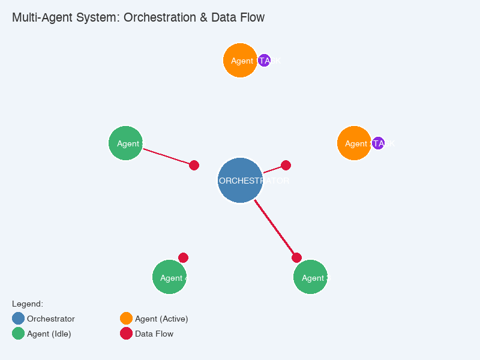

# 🤖 Understanding Multi-Agent AI Systems: A Complete Guide

**Meta Description:** Discover how Multi-Agent AI Systems (MAS) revolutionize artificial intelligence through distributed intelligence, agent collaboration, and real-world applications in logistics, healthcare, smart cities, and more.

## Table of Contents

- [What Are Multi-Agent Systems?](#what-are-multi-agent-systems)
- [How Multi-Agent Systems Work](#how-multi-agent-systems-work)
- [Real-World Applications](#real-world-applications)
- [Benefits and Challenges](#benefits-and-challenges)
- [Future of Multi-Agent Systems](#future-of-multi-agent-systems)
- [FAQ](#frequently-asked-questions)

---

Imagine a world where complex problems aren't solved by a single, monolithic super-brain, but by a symphony of specialized intelligences. Each contributes its unique expertise, collaborating and even negotiating to achieve a common goal. This isn't science fiction; it's the rapidly evolving reality of **Multi-Agent AI Systems (MAS)**—a revolutionary approach to artificial intelligence that distributes intelligence across multiple autonomous agents. 🚀

In today's interconnected and dynamic world, relying on a single AI to manage everything from smart cities to disaster response is often impractical, inefficient, and prone to failure. Just as a human organization benefits from diverse teams and delegated responsibilities, AI systems gain immense power and resilience when designed as a collective of interacting agents.

This guide will take you on a comprehensive journey through the fascinating landscape of Multi-Agent Systems. We'll demystify what they are, how they operate, explore their groundbreaking applications, weigh their benefits against their challenges, and peer into the exciting future they promise. If you've ever wondered how AI can tackle truly grand challenges, distributed intelligence is your answer.

## 🤔 What Are Multi-Agent Systems? {#what-are-multi-agent-systems}

At its core, a **Multi-Agent System (MAS)** is a sophisticated AI framework comprising multiple intelligent entities, known as "agents," that interact within a shared environment. Think of it like a highly organized ant colony or a well-coordinated sports team, but with each member being an autonomous AI. Unlike a single, all-encompassing AI, MAS distribute intelligence and tasks among several agents, allowing for more robust, scalable, and flexible solutions to problems that would overwhelm any solitary intelligence.

To truly grasp MAS, it's essential to understand the defining characteristics of these individual agents:

* **🔄 Autonomy:** Agents operate independently, making decisions and executing actions without constant human or external oversight. They are masters of their own internal state and behavior, much like an individual player on a sports team who knows their role and makes real-time decisions.
* **⚡ Proactiveness:** These aren't just reactive machines. Agents are goal-directed and take initiative to achieve their objectives. They anticipate needs, plan ahead, and actively seek opportunities to fulfill their purpose, rather than merely waiting for a command.
* **⚙️ Reactivity:** Despite their proactive nature, agents are also highly responsive. They continuously perceive their environment and react promptly to changes, threats, or opportunities. If a sudden obstacle appears on a robot's path, it reacts immediately.
* **🤝 Social Ability:** Perhaps the most distinguishing feature, agents interact with other agents (and sometimes humans) through communication, cooperation, coordination, and negotiation. They don't operate in isolation but are part of a digital society, sharing information and working together.

### 🆚 Distinction from Single-Agent Systems

The difference between a single-agent system and a MAS is profound. Imagine a single master chef 👨‍🍳 trying to prepare a multi-course banquet for hundreds of guests alone. The chef would quickly become a bottleneck, prone to errors, and utterly unable to scale.

Now, imagine that same banquet being prepared by a brigade of specialized chefs: one for appetizers, another for main courses, a pastry chef, and a sommelier, all communicating and coordinating. This illustrates the power of a MAS. 👥 A single-agent system relies on one AI entity for all decision-making and actions, leading to potential bottlenecks, single points of failure, and difficulty scaling for complex, distributed problems. MAS overcome these limitations by distributing intelligence and labor, mirroring how complex problems are often solved in human societies through collaboration and specialization. This distribution of intelligence makes MAS inherently more resilient, adaptable, and efficient for tackling real-world complexity.

## ⚙️ How Multi-Agent Systems Work: Architecture and Interaction {#how-multi-agent-systems-work}

The magic of Multi-Agent Systems lies not just in the individual agents, but in the intricate ways they are designed, how they "think," and how they interact. Understanding **multi-agent system architecture** involves grasping key conceptual building blocks and the common architectural patterns that bring these distributed AI systems to life.

*Visualization showing agents performing tasks under orchestration, with data flowing bidirectionally between the orchestrator and agents. Notice how agents become active (orange) when performing tasks, and data packets (red) continuously flow to coordinate their activities.*

### 🔑 Key Concepts

#### 🧠 Agent Types: The Minds of the Collective

Not all agents are created equal. Their internal complexity dictates their behavior:

* **⚡ Reactive Agents:** These are the simplest, operating on basic "if-then" rule sets. They respond directly to specific environmental stimuli without an internal model of the world or long-term planning. Think of a thermostat: if temperature > X, then turn on AC. 🌡️
* **🧠 Deliberative Agents (e.g., BDI Agents):** These are the thinkers. They maintain an internal model of their environment, engaging in reasoning, planning, and goal-directed behavior. The **Belief-Desire-Intention (BDI)** model is a prominent example:
  * **💭 Beliefs:** Their knowledge about the world (e.g., "the traffic light is red").
  * **🎯 Desires:** Their goals or states they wish to achieve (e.g., "I want to reach the destination quickly").
  * **📋 Intentions:** Their commitments to execute specific plans to achieve desires (e.g., "I will wait for the light to turn green, then proceed").
* **🔄 Hybrid Agents:** Combining the best of both worlds, these agents can react quickly to immediate threats or opportunities while also engaging in more complex, long-term planning when necessary.

#### 🌍 The Environment: Their Shared Reality

The environment is the stage where agents perform. It's the shared context that defines the rules of interaction, available resources, and potential obstacles. Environments can range from a digital simulation to the physical world, varying in dynamism, observability, and continuity.

#### 💬 Communication: The Language of Agents

For agents to collaborate, they must communicate. This isn't just sending data; it's exchanging meaningful messages:

* **Agent Communication Languages (ACLs):** These are standardized languages, like FIPA ACL, that define message structures, performatives (e.g., `request`, `inform`, `agree`), and content languages, ensuring agents can understand each other regardless of their internal design.
* **Communication Protocols:** These define the sequence of messages exchanged for specific interactions, like a "request-response" handshake.

#### 🤝 Coordination and Cooperation: Working Together

Managing interdependencies is crucial for agents to achieve collective or individual goals without conflict:

* **🎯 Centralized Coordination:** A dedicated coordinator agent manages task allocation and resolves conflicts, much like a project manager.
* **🌐 Decentralized Coordination:** Agents coordinate autonomously through negotiation, social laws, or emergent behaviors, similar to how drivers subtly adjust their speed based on surrounding cars without a central traffic controller.
* **💰 Market-Based Mechanisms:** Agents use economic principles (bidding, auctions) to allocate tasks or resources, creating a dynamic marketplace within the system.
* **📜 Social Laws/Conventions:** Predefined rules or norms that agents adhere to in order to ensure harmonious interaction, like traffic laws for autonomous vehicles.

#### 🤝 Negotiation: Reaching Agreement

A specialized form of interaction where agents attempt to reach a mutually acceptable agreement, often involving concessions. This is common in scenarios like automated price negotiation in e-commerce.

#### 📚 Learning: Growing Smarter

Agents can learn from their experiences, adapting their behaviors, beliefs, or strategies over time. **Multi-Agent Reinforcement Learning (MARL)** is a rapidly advancing field where agents learn optimal policies through trial and error in shared environments, often collaborating or competing to maximize collective rewards.

### 🏗️ Architecture Patterns: The Blueprint for Interaction

MAS architectures define how agents are structured and how they interact to form a coherent system.

* **🔗 Distributed Problem Solving (DPS):** Here, a group of agents cooperatively solves a problem beyond any single agent's capability. Imagine a complex engineering design where different agents handle structural analysis, material selection, and cost estimation, then integrate their findings.
* **📋 Blackboard Systems:** Agents communicate indirectly by writing and reading information from a shared data structure called a "blackboard." A control mechanism orchestrates access. A medical diagnosis system could use this, with different expert agents posting findings and hypotheses to a shared board, leading to a collaborative diagnosis.
* **🖥️ Client-Server Architecture:** A common model where agents act as either clients requesting services or servers providing them. An agent-based e-commerce platform could have user agents (clients) requesting product information from seller agents (servers).
* **🌐 Peer-to-Peer (P2P) Architecture:** Agents interact directly without a central server, distributing control and resources across the network. This is seen in decentralized file-sharing or blockchain networks.
* **🌳 Hierarchical Architecture:** Agents are organized in a tree-like structure with different levels of authority. A supervisor agent orchestrates assembly line agents, which in turn control individual robot arm agents in a manufacturing system.
* **🔗 Federated Architecture:** A collection of independent MAS, each with its own internal structure, that can interact to achieve larger goals. This allows different smart city MAS (e.g., traffic management, energy grid, waste collection) to share data and coordinate for city-wide optimization.

## 🌍 Real-World Applications of Multi-Agent Systems {#real-world-applications}

The distributed intelligence and adaptability of Multi-Agent Systems make them ideal for tackling complex, dynamic problems across a myriad of industries. From **supply chain optimization** to **smart city management**, MAS are transforming how we solve real-world challenges. Here are some compelling applications:

* **📦 Logistics and Supply Chain Management:** MAS are revolutionizing how goods move.

  

  * **Use Case:** Optimizing delivery routes, managing warehouse operations, and coordinating freight movements.
  * **Example:** Amazon's fulfillment centers employ MAS to coordinate thousands of robotic agents (like Kiva robots) for picking and packing orders, optimizing storage, and streamlining workflows. In traffic management, agents dynamically adjust traffic lights and reroute vehicles in real-time to minimize congestion.

* **⚡ Smart Grids and Energy Management:** Powering the future efficiently.

  

  * **Use Case:** Balancing energy supply and demand, managing distributed renewable energy sources, and optimizing energy consumption.
  * **Example:** Microgrid systems feature agents representing solar panels, wind turbines, battery storage, and consumer loads. These agents negotiate to optimize energy flow, reduce costs, and ensure grid stability, predicting demand and adjusting generation accordingly.

* **🤖 Robotics and Swarm Robotics:** Coordinating physical agents for complex tasks.

  

  * **Use Case:** Orchestrating multiple robots for tasks like exploration, mapping, surveillance, or construction.
  * **Example:** Swarms of Unmanned Aerial Vehicles (UAVs) act as agents to survey vast areas after a disaster. They collectively map terrain, identify survivors, and relay information, even if individual UAVs have limited capabilities, showcasing emergent intelligence.

* **🏥 Healthcare:** Enhancing patient care and operational efficiency.

  

  * **Use Case:** Patient monitoring, drug discovery, hospital management, and personalized treatment plans.
  * **Example:** Intelligent agents monitor vital signs in intensive care units, detecting anomalies and alerting medical staff. Other agents might assist in drug discovery by simulating molecular interactions and predicting efficacy.

* **💹 Financial Trading and Market Simulation:** Automating complex financial decisions.
  * **Use Case:** Automated trading strategies, risk management, and simulating market behavior.
  * **Example:** Algorithmic trading platforms deploy multiple "trading agents" that analyze market data, execute trades, and manage portfolios based on predefined strategies, often interacting with other agents in a simulated or real market environment.

* **🎮 Gaming and Simulation:** Creating immersive and dynamic virtual worlds.
  * **Use Case:** Generating realistic and dynamic non-player character (NPC) behavior and simulating complex scenarios.
  * **Example:** In strategy games, individual units or factions are modeled as agents with their own goals and decision-making processes, leading to more emergent and challenging gameplay. Military simulations use MAS to model enemy forces and civilian populations accurately.

* **🛒 E-commerce and Online Services:** Personalizing experiences and automating transactions.
  * **Use Case:** Personalized recommendations, automated price negotiation, and intelligent customer support.
  * **Example:** Shopping agents scour the internet for the best deals, or agents negotiate prices with seller agents on behalf of a user. Recommender systems use agents to understand user preferences and suggest products or content.

* **🚨 Disaster Response and Search & Rescue:** Deploying autonomous aid in critical situations.
  * **Use Case:** Coordinating emergency services, deploying autonomous vehicles for reconnaissance, and managing resources in disaster zones.
  * **Example:** Teams of robotic agents deployed into collapsed buildings to search for survivors, map hazardous areas, and deliver supplies, coordinating their efforts to cover the area efficiently and safely.

## ⚖️ Benefits and Challenges of Multi-Agent Systems {#benefits-and-challenges}

While Multi-Agent Systems promise transformative solutions for complex problems, they also come with their own set of advantages and inherent complexities. Understanding both sides is crucial for implementing effective MAS solutions.

### ✅ Benefits

* **🛡️ Robustness and Fault Tolerance:** One of the greatest strengths. The distributed nature means that the failure of a single agent does not necessarily cripple the entire system. Other agents can often take over that agent's tasks or the system can reconfigure itself, much like a decentralized network.
* **📈 Scalability:** As problems grow larger or more complex, new agents can be added to the system to handle the increased workload without requiring a complete redesign of the existing architecture.
* **🔄 Flexibility and Adaptability:** Agents can be designed to adapt to changing environments and requirements. New functionalities can be introduced simply by adding specialized agents or modifying existing ones, making the system highly versatile.
* **⚡ Parallelism:** Multiple agents can perform tasks concurrently, leading to significantly faster execution times for complex problems that can be decomposed into smaller, parallelizable sub-problems.
* **🧩 Modularity and Reusability:** Agents are often self-contained units with clear interfaces, making them easier to design, test, debug, and reuse in different systems or contexts, reducing development time and cost.
* **🌐 Handling Distributed Data and Control:** MAS are naturally suited for problems where data and control are inherently distributed across various locations or entities, mimicking real-world scenarios more accurately.

### ⚠️ Challenges

* **🔧 Complexity of Design and Implementation:** Designing robust communication, coordination, and negotiation protocols for numerous interacting agents can be extremely challenging. The sheer number of potential interactions and states can quickly become overwhelming.
* **📡 Coordination and Communication Overhead:** The need for agents to constantly communicate and coordinate can introduce significant overhead, impacting system performance, especially in very large systems or those with limited bandwidth.
* **🌀 Emergent Behavior:** The interaction of many simple agents can lead to complex, unpredictable, and sometimes undesirable emergent behaviors that are difficult to anticipate, debug, or control. This can be a double-edged sword, leading to both innovation and unforeseen problems.
* **🔒 Trust and Security:** In open MAS where agents from different organizations interact, ensuring that agents are trustworthy and that their communication is secure is paramount. Malicious agents could compromise the entire system.
* **✅ Verification and Validation:** Proving the correctness, reliability, and safety of a MAS is significantly harder than for a single-agent system due to the dynamic interactions, non-determinism, and potential for emergent behavior.
* **⚖️ Ethical Considerations:** As MAS become more autonomous and capable, questions of responsibility, accountability for actions, potential biases, and overall societal impact become critical. Who is responsible when an autonomous MAS makes a harmful decision?
* **💻 Resource Management:** Efficiently allocating computational resources (CPU, memory, bandwidth) and managing conflicts over shared resources among multiple agents can be a difficult optimization problem.

## 🔮 Future of Multi-Agent Systems: Trends and Outlook {#future-of-multi-agent-systems}

The field of Multi-Agent Systems is a vibrant and rapidly evolving frontier in artificial intelligence, constantly pushing the boundaries of what's possible. The future holds even more sophisticated, autonomous, and collaborative systems that will revolutionize industries. 🚀

* **🤖 Integration with Machine Learning (ML) and Deep Learning (DL):** This is a cornerstone of future MAS.
  * **📚 Multi-Agent Reinforcement Learning (MARL):** A major trend enabling agents to learn optimal policies through trial and error in shared environments, often collaborating or competing. This is crucial for developing agents that can adapt to highly dynamic and complex environments without explicit programming, from robotic teams to smart city management.
  * **🔐 Federated Learning:** MAS can coordinate distributed learning processes where agents train models locally on their data and only share aggregated updates, preserving data privacy and enhancing security.

* **👥 Human-Agent Collaboration (HAC):** The future will see humans and AI agents working seamlessly together, leveraging the strengths of both. This requires advancements in natural language understanding, explainable AI, and intuitive interfaces to enable effective human-agent teams. Imagine human doctors collaborating with diagnostic agents, or human crisis managers coordinating with robotic search-and-rescue agents.

* **🔍 Explainable AI (XAI) in MAS:** Increasing the transparency and interpretability of agent decisions and collective MAS behavior is becoming vital, especially for critical applications. Understanding "why" a system acted a certain way is crucial for trust, debugging, and ethical oversight.

* **⭐ Trust and Reputation Systems:** For open and dynamic MAS, sophisticated mechanisms for agents to assess the trustworthiness and reliability of other agents are essential. This could involve blockchain-based reputation ledgers, ensuring secure and verifiable interactions.

* **⚖️ Ethical AI and Regulation for MAS:** As MAS become more autonomous, addressing their ethical implications – particularly concerning accountability, bias, fairness, and potential societal impact – is paramount. This includes developing robust regulatory frameworks and ethical guidelines for MAS design and deployment.

* **⛓️ Decentralized Autonomous Organizations (DAOs) and Blockchain:** Exploring how MAS can underpin DAOs, where agents execute smart contracts and manage shared resources on a blockchain, enabling truly decentralized and autonomous organizations without human intermediaries.

* **🐜 Large-scale MAS and Swarm Intelligence:** Developing techniques for managing and coordinating MAS with thousands or even millions of agents, inspired by natural swarms (e.g., ant colonies, bird flocks) to solve complex problems more efficiently and robustly.

* **⚛️ Quantum Multi-Agent Systems (QMAs):** An emerging theoretical area exploring how quantum computing principles could enhance MAS, potentially enabling more efficient communication, computation, and coordination for certain types of problems, pushing the boundaries of computational power.

The future of MAS lies in creating increasingly intelligent, autonomous, and cooperative systems that can operate effectively in highly complex, uncertain, and dynamic environments, often in close collaboration with humans, to solve some of the world's most pressing challenges.

## 🎯 Conclusion

Multi-Agent Systems represent a paradigm shift in how we conceive and build artificial intelligence. Moving beyond the limitations of single, monolithic AIs, MAS harness the power of distributed intelligence, enabling a collective of autonomous agents to collaborate, coordinate, and even negotiate to tackle problems of unparalleled complexity. 🌟

We've explored the fundamental characteristics that define an intelligent agent – autonomy, proactiveness, reactivity, and social ability – and delved into the sophisticated concepts that govern their interactions, from various agent types and communication protocols to intricate coordination mechanisms and learning capabilities. We then examined the diverse architectural patterns that bring these systems to life, from blackboard systems to federated architectures.

The real-world impact of MAS is already evident, optimizing logistics, managing smart grids, coordinating robotic swarms, and revolutionizing healthcare and finance. While offering immense benefits in robustness, scalability, and flexibility, they also present significant challenges in design complexity, emergent behavior, and ethical considerations.

Looking ahead, the integration of advanced machine learning techniques like MARL, the development of seamless human-agent collaboration, and a strong focus on explainability and ethical guidelines will shape the next generation of MAS. These systems are not just about building smarter machines; they're about building smarter *societies* of machines, capable of adapting, learning, and evolving to address the grand challenges of our interconnected world. The journey into multi-agent intelligence has only just begun, promising a future where AI operates not as a solitary genius, but as a brilliant, collaborative team.

---

## Frequently Asked Questions (FAQ) {#frequently-asked-questions}

### What is a Multi-Agent System (MAS)?

A Multi-Agent System (MAS) is an AI framework comprising multiple autonomous, intelligent entities called "agents" that interact within a shared environment. Unlike single-agent systems, MAS distribute intelligence and tasks among several agents, enabling more robust, scalable solutions to complex problems.

### How do Multi-Agent Systems differ from single-agent AI?

Single-agent systems rely on one AI entity for all decision-making, creating potential bottlenecks and single points of failure. Multi-Agent Systems distribute intelligence across multiple agents, allowing for parallel processing, fault tolerance, and better scalability for complex, distributed problems.

### What are the key characteristics of AI agents in MAS?

AI agents in Multi-Agent Systems exhibit four key characteristics:
- **Autonomy:** Independent decision-making and action execution
- **Proactiveness:** Goal-directed behavior and initiative-taking
- **Reactivity:** Responsive to environmental changes
- **Social Ability:** Communication, cooperation, and coordination with other agents

### What are common applications of Multi-Agent Systems?

Multi-Agent Systems are used in:
- Logistics and supply chain management
- Smart grids and energy management
- Swarm robotics and autonomous vehicles
- Healthcare monitoring and drug discovery
- Financial trading and market simulation
- Smart city infrastructure
- Disaster response and search & rescue

### What are the main benefits of Multi-Agent Systems?

Key benefits include:
- **Robustness and fault tolerance:** System continues operating if individual agents fail
- **Scalability:** Easy to add new agents as problems grow
- **Flexibility:** Adaptable to changing requirements
- **Parallelism:** Faster execution through concurrent processing
- **Modularity:** Reusable, self-contained agent components

### What challenges do Multi-Agent Systems face?

Main challenges include:
- Design and implementation complexity
- Coordination and communication overhead
- Unpredictable emergent behaviors
- Trust and security concerns
- Verification and validation difficulties
- Ethical considerations and accountability

### What is Multi-Agent Reinforcement Learning (MARL)?

Multi-Agent Reinforcement Learning (MARL) is a field where multiple agents learn optimal policies through trial and error in shared environments. Agents collaborate or compete to maximize collective rewards, enabling adaptation to dynamic environments without explicit programming.

### How will Multi-Agent Systems evolve in the future?

Future trends include:
- Integration with machine learning and deep learning
- Enhanced human-agent collaboration
- Explainable AI (XAI) for transparency
- Blockchain-based trust systems
- Large-scale swarm intelligence
- Quantum Multi-Agent Systems (QMAs)

---

**Related Topics:** [Distributed AI](#), [Agent-Based Computing](#), [Swarm Intelligence](#), [Autonomous Systems](#), [AI Architecture](#)

**Last Updated:** January 2026
