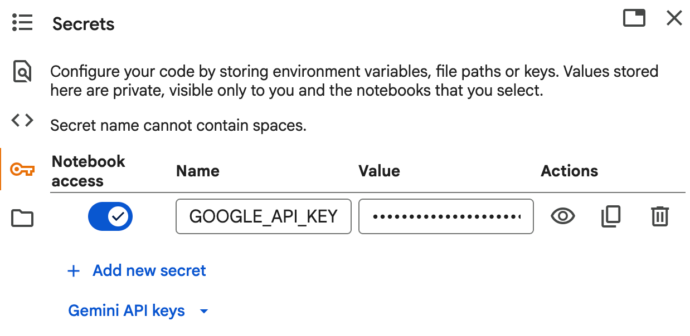

# Building a Multi-Agent System using Gemini API

As an aspiring ML engineer, you’ve probably worked on single-agent models, like a chatbot that responds to a single query. But the next frontier in AI isn’t about one agent; it’s about a team of agents known as Multi-Agent Systems. If you want to learn building multi agent systems, this article is for you. In this article, I’ll guide you through the process of building a multi-agent system from the ground up, using the Gemini API.

In multi-agent systems, we design a system of multiple agents, where each agent is a simple AI model given one specific job. They work in sequence, passing information to each other to achieve a complex goal.

In our project, we’ll build an AI Research Assistant. It will be composed of a team of three specialist agents:

1. **The Planner:** The project manager who breaks down the main topic into manageable components.
2. **The Researcher**: The diligent analyst who finds information for each sub-topic.
3. **The Synthesizer**: The expert writer who compiles all the research into a final report.

So, let’s build this multi-agent system using the Gemini API step by step.

## Setting Up the Environment

As we will use the Gemini API to build this agent, let’s first start by configuring the Gemini model with a secure API key. Make sure to get your Gemini API key from here. Store your API Key in your colab like this:



## Store your API Key in your colab

This is a crucial first step for any Gemini project. Your notebook does this perfectly by fetching the key from Colab’s user data. Next, write the code below to complete your setup:

```bash
pip install google-generativeai
```

```python
import os
from google.colab import userdata
import google.generativeai as genai
​
def configure():
    secret_name = "GOOGLE_API_KEY"
​
    api_key = userdata.get(secret_name)
    if not api_key:
        raise ValueError(f"Secret '{secret_name}' not found. Please check the name in Colab's Secrets.")
​
    genai.configure(api_key=api_key)
    return genai.GenerativeModel('gemini-1.5-pro-latest')
```

## Agent 1: The Planner

Every good research project starts with a solid plan. A vague goal leads to an unclear outcome. The Planner’s only job is to prevent this by breaking down a broad topic into a list of specific, researchable questions.

Its role will be to provide structure and focus. Here’s how to build the planner agent:

```python
def planner_agent(model, topic: str) -> list[str]:
    print("Planner Agent: Creating a research plan...")
    prompt = f"""
    You are an expert research planner. Your task is to break down the following topic
    into 3-5 specific, answerable questions. Return these questions as a Python list of strings.
​
    TOPIC: "{topic}"
​
    Example output: ["question 1", "question 2", "question 3"]
    """
    try:
        response = model.generate_content(prompt)
        plan_str = response.text.strip().replace('[', '').replace(']', '').replace('"', '')
        plan = [q.strip() for q in plan_str.split(',') if q.strip()]
​
        print("Plan created:")
        for i, q in enumerate(plan, 1):
            print(f"   {i}. {q}")
        return plan
    except Exception as e:
        print(f"Error in Planner Agent: {e}")
        return []
```

The core part here is in the prompt engineering. We explicitly tell the model its persona (You are an expert research planner) and its exact task, including the output format (Return these questions as a Python list of strings). This is a core skill in AI engineering; constraining the model to get predictable, sound output.

## Agent 2: The Search Agent

Once the plan is set, we need an agent to execute it. The Search Agent takes one question at a time from the Planner’s list and uses a special tool, Google Search, to find the answer.

The role of this agent will be to gather raw, factual information for a single, specific question. It doesn’t write the report; it just finds the data. Here’s how to build the search agent:

```python
def search_agent(model, question: str) -> str:
    print(f"Search Agent: Researching question: '{question}'...")
    try:
        search_tool = genai.protos.Tool(
            google_search_retrieval=genai.protos.GoogleSearchRetrieval(disable_attribution=True)
        )
        prompt = f"Provide a detailed answer to the following question: {question}"
        response = model.generate_content(prompt, tools=[search_tool])
​
        print("   - Information found.")
        return response.text
    except Exception as e:
        print(f"Error in Search Agent: {e}")
        return ""
```

The key line is `genai.protos.Tool(…)`. Here, you’re telling the model, “You are no longer just a text generator. You can now browse the internet.” When you pass this tool in the generate_content call, the model can decide on its own to use Google Search to find up-to-date, relevant information to answer the prompt. This is a fundamental concept in building modern, grounded AI applications.

## Agent 3: The Synthesizer

With a pile of research notes, we need someone to make sense of it all. The Synthesizer’s job is to take all the fragmented answers from the Search Agent and weave them into a single, well-structured, and coherent report.

The role of this agent is to synthesize information, not to find it. It is explicitly stated that only the data provided by the Search Agent should be used. Here’s how to build the synthesizer agent:

```python
def synthesizer_agent(model, topic: str, research_results: list) -> str:
    print("Synthesizer Agent: Writing the final report...")
​
    research_notes = ""
    for question, data in research_results:
        research_notes += f"### Question: {question}\n### Research Data:\n{data}\n\n---\n\n"
​
    prompt = f"""
    You are an expert research analyst. Your task is to synthesize the provided research notes into a comprehensive, well-structured report on the topic: "{topic}".
​
    The report should have an introduction, a body that covers the key findings from the notes, and a conclusion. Use the information from the research notes ONLY.
​
    ## Research Notes ##
    {research_notes}
    """
    try:
        response = model.generate_content(prompt)
        return response.text
    except Exception as e:
        print(f"Error in Synthesizer Agent: {e}")
        return "Error: Could not generate the final report."
```

Notice how we first aggregate all the research results into a single `research_notes` string. This becomes the context for the final prompt. The instruction “Use the information from the research notes ONLY” is a critical constraint that dramatically improves the quality and reliability of the output.

## The Conductor: The main() Orchestrator

Now, we will build the main function that directs the entire process, ensuring each agent performs at the right time and that their work flows seamlessly from one to the next:

```python
def main():    
    try:
        model = configure()
    except ValueError as e:
        print(e)
        return
​
    print("\nHello! I am your AI Research Assistant.")
    topic = input("What topic would you like me to research today? ")
​
    if not topic.strip():
        print("A topic is required to begin research. Exiting.")
        return
​
    print(f"\nStarting research process for: '{topic}'")
​
    research_plan = planner_agent(model, topic)
    if not research_plan:
        print("Could not create a research plan. Exiting.")
        return
​
    research_results = []
    for question in research_plan:
        research_data = search_agent(model, question)
        if research_data:
            research_results.append((question, research_data))
​
    if not research_results:
        print("Could not find any information during research. Exiting.")
        return
​
    final_report = synthesizer_agent(model, topic, research_results)
​
    print("\n\n--- FINAL RESEARCH REPORT ---")
    print(f"## Topic: {topic}\n")
    print(final_report)
    print("--- END OF REPORT ---")
​
main()
```

The flow is simple and logical:

- Get the topic.
- Call the Planner to create the plan.
- Loop through the plan, calling the Searcher for each item.
- Call the Synthesizer with the collected research.
- Present the final report.

This orchestration is the essence of a multi-agent system. Here’s the kind of output you will see in the end:

```code
AI Research Assistant is active.
Starting research for: 'Why Himachal Pradesh is facing so much rainfall this year'
Planner Agent: Creating a research plan...
Plan created.
Search Agent: Researching: 'What is the interaction between the Western Disturbance and the monsoon in 2025?'...
...
```

## Final Words

You’ve just learned a design pattern that powers some of the most sophisticated AI applications in the world. Now, open a Colab notebook, set up your Gemini API key, and run the code. Then, more importantly, modify it. I hope you liked this article on building a multi-agent system from the ground up, using the Gemini API. Feel free to ask valuable questions in the comments section below.
