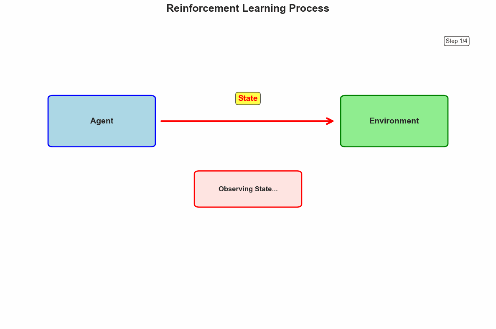
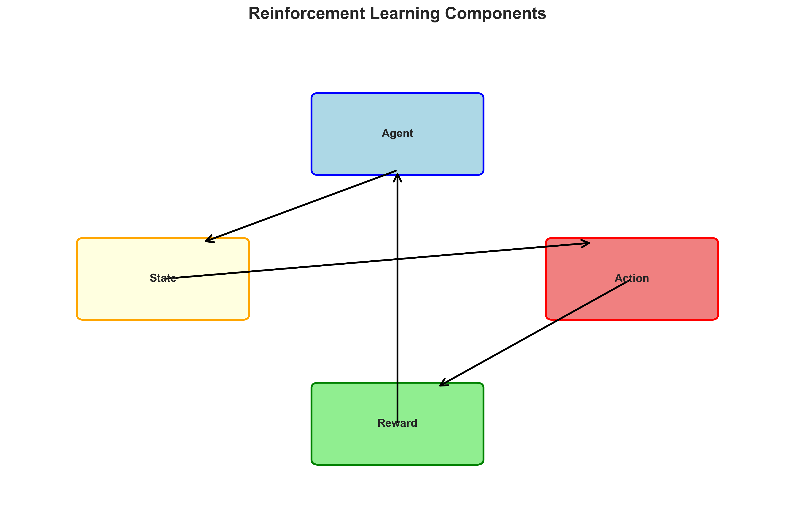
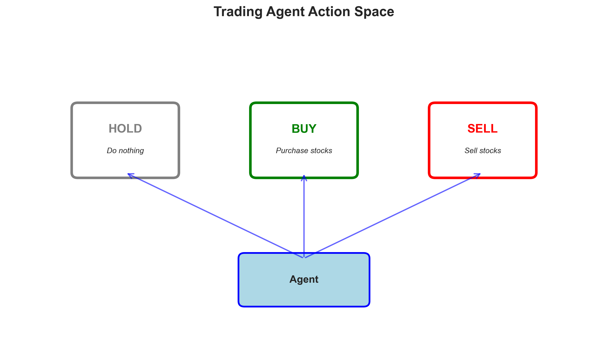
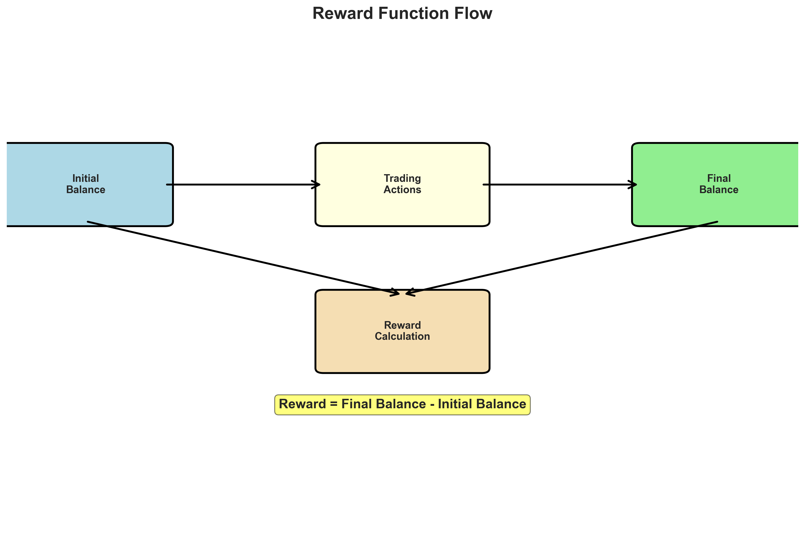
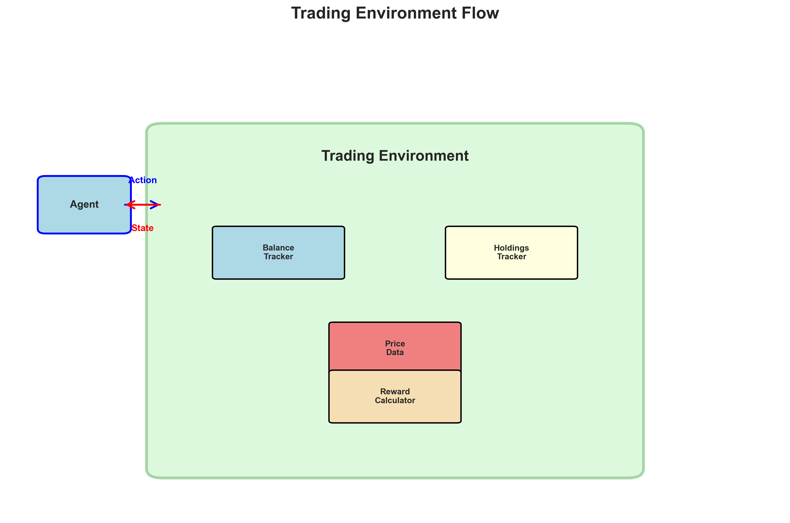
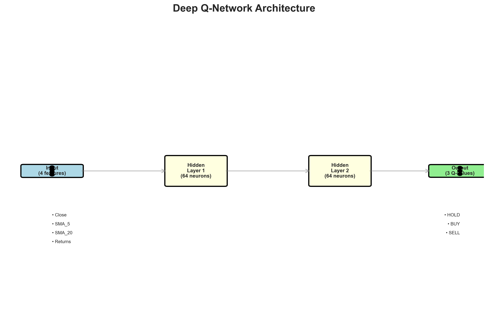
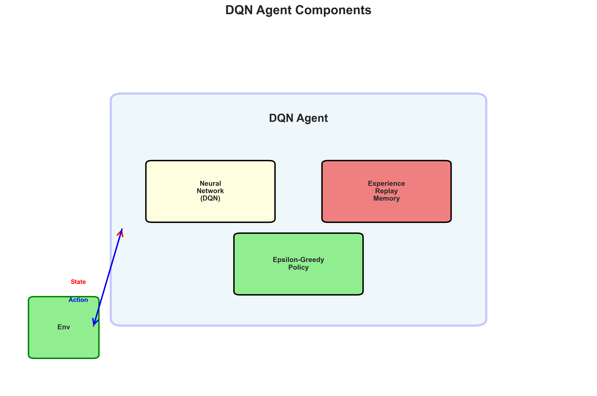
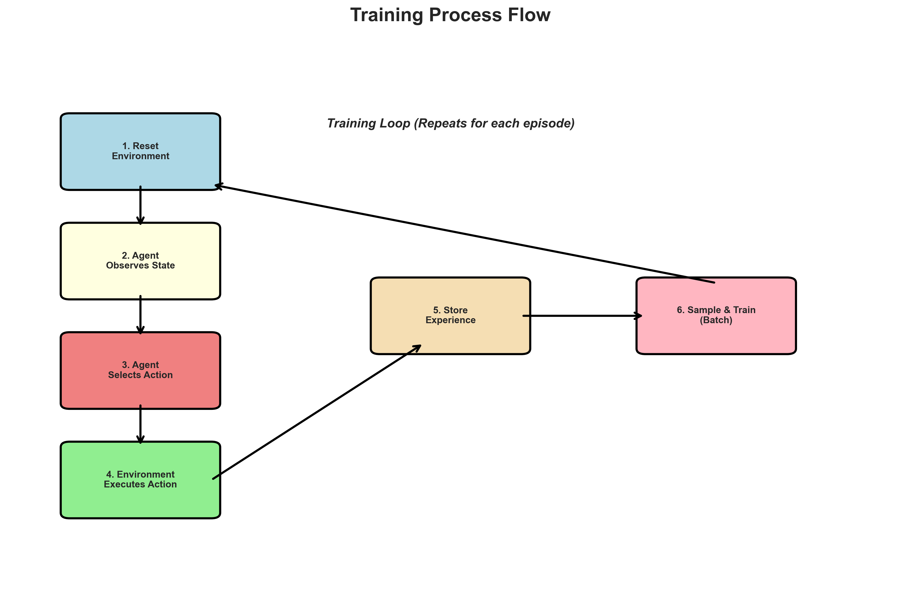

# Building an AI Agent using Agentic AI

## Overview

Agentic AI refers to artificial intelligence systems that can perceive their environment, make decisions, and act autonomously to achieve a goal. These agents typically use reinforcement learning (RL) methods to optimize their behavior over time through interactions with an environment. In this guide, we'll explore how to build an AI Agent for trading using Agentic AI with Python and Deep Q-Learning.


*Figure 1: Agentic AI System Architecture - An agent interacts with an environment, receives states and rewards, and takes actions to maximize cumulative rewards.*

---

## Understanding the Components of Agentic AI

Agentic AI involves several key components. In this guide, we'll be building an AI Agent for trading. Let's understand the key components of Agentic AI with our trading example:


*Figure 2: Reinforcement Learning Components - The agent, environment, state, action space, and reward function work together in a feedback loop.*

### 1. The Agent

The agent is the decision-making entity in the AI system. In our case, the DQN (Deep Q-Network) trading agent will be responsible for making trading decisions based on market data.

**Key Characteristics:**
- Makes decisions based on current state
- Learns from experience
- Balances exploration and exploitation
- Optimizes for long-term rewards

### 2. The Environment

The environment is the external system in which the agent operates. Our trading environment will consist of stock market data, where the agent will interact with price movements and execute trades.

**Key Characteristics:**
- Provides states to the agent
- Responds to agent actions
- Generates rewards based on actions
- Defines episode termination conditions

### 3. The State

The state represents the information available to the agent at any given time. Our trading agent's state includes:
- Stock's closing price
- 5-day Simple Moving Average (SMA)
- 20-day Simple Moving Average (SMA)
- Daily returns

**State Representation:**
```python
State = [Close_Price, SMA_5, SMA_20, Returns]
```

### 4. The Action Space

The action space defines what actions the agent can take. Our trading agent has three possible actions:

- **HOLD (0)**: Do nothing, maintain current position
- **BUY (1)**: Purchase stocks with available balance
- **SELL (2)**: Sell held stocks


*Figure 3: Trading Agent Action Space - The agent can choose to hold, buy, or sell based on market conditions.*

### 5. The Reward Function

The reward function determines the agent's performance by assigning a numerical value to its actions. The goal of our trading agent will be to maximize total profit by the end of the trading session.

**Reward Calculation:**
- Immediate reward: 0 during trading
- Final reward: `Final Balance - Initial Balance`
- Positive reward = profit, Negative reward = loss


*Figure 4: Reward Function Flow - Rewards are calculated based on trading performance, with final profit/loss as the primary metric.*

---

## Building an AI Agent using Agentic AI: Getting Started

### Prerequisites

Before we begin, ensure you have:

1. **Python 3.8+** installed
2. **Required libraries**: yfinance, pandas, numpy, torch
3. **Basic understanding** of reinforcement learning concepts
4. **GPU (optional)**: For faster training, though CPU works fine for this example

### Step 1: Import Required Libraries

```python
import yfinance as yf
import pandas as pd
import numpy as np
import torch
import torch.nn as nn
import torch.optim as optim
import random
from collections import deque
```

### Step 2: Download Stock Market Data

We'll use Apple (AAPL) stock data from Yahoo Finance:

```python
# Define stock symbol and time period
symbol = "AAPL"
start_date = "2020-01-01"
end_date = "2025-02-14"

# Download historical data
data = yf.download(symbol, start=start_date, end=end_date)
```

### Step 3: Feature Engineering

Calculate technical indicators that help the AI agent make better trading decisions:

```python
# Feature engineering
data['SMA_5'] = data['Close'].rolling(window=5).mean()
data['SMA_20'] = data['Close'].rolling(window=20).mean()
data['Returns'] = data['Close'].pct_change()
```

**Technical Indicators Explained:**
- **SMA_5**: 5-day Simple Moving Average - short-term trend indicator
- **SMA_20**: 20-day Simple Moving Average - medium-term trend indicator
- **Returns**: Daily percentage change - momentum indicator

### Step 4: Data Preprocessing

Clean the data by removing missing values:

```python
# Drop NaN values and reset index
data.dropna(inplace=True)
data.reset_index(drop=True, inplace=True)
```

### Step 5: Define Action Space

```python
# Define action space
ACTIONS = {0: "HOLD", 1: "BUY", 2: "SELL"}
```

This action space is used to train the reinforcement learning model.

### Step 6: State Extraction Function

```python
# Get state function
def get_state(data, index):
    return np.array([
        float(data.loc[index, 'Close']),
        float(data.loc[index, 'SMA_5']),
        float(data.loc[index, 'SMA_20']),
        float(data.loc[index, 'Returns'])
    ])
```

This function extracts the state representation from the dataset at a given time index. The state is an array containing:
- Closing price
- 5-day SMA
- 20-day SMA
- Daily return percentage

This numerical representation of the stock market is fed into the AI model to make trading decisions.

---

## Building The Trading Environment

We will now define a trading environment to interact with the Deep Q-Network (DQN) AI agent, which will allow it to learn how to trade stocks profitably.


*Figure 5: Trading Environment Flow - The environment simulates stock trading, tracking balance, holdings, and providing rewards.*

```python
# Trading environment
class TradingEnvironment:
    def __init__(self, data):
        self.data = data
        self.initial_balance = 10000
        self.balance = self.initial_balance
        self.holdings = 0
        self.index = 0

    def reset(self):
        """Reset the environment to initial state"""
        self.balance = self.initial_balance
        self.holdings = 0
        self.index = 0
        return get_state(self.data, self.index)

    def step(self, action):
        """Execute an action and return next state, reward, done flag, and info"""
        price = float(self.data.loc[self.index, 'Close'])
        reward = 0

        if action == 1 and self.balance >= price:  # BUY
            self.holdings = self.balance // price
            self.balance -= self.holdings * price
        elif action == 2 and self.holdings > 0:  # SELL
            self.balance += self.holdings * price
            self.holdings = 0

        self.index += 1
        done = self.index >= len(self.data) - 1

        if done:
            reward = self.balance - self.initial_balance

        next_state = get_state(self.data, self.index) if not done else None
        return next_state, reward, done, {}
```

**Environment Methods:**
- **`reset()`**: Initializes a new episode, returns initial state
- **`step(action)`**: Executes an action, returns (next_state, reward, done, info)

The environment is implemented as a class that simulates the stock market. It tracks the agent's balance, holdings, and current market index, and it provides new states and rewards in response to the agent's actions.

---

## The Deep Q-Network (DQN)

DQN is a neural network that approximates the Q-values for each state-action pair. We will now define the neural network architecture for our Deep Q-Network. It will be responsible for predicting the best trading actions based on the stock market state.


*Figure 6: Deep Q-Network Architecture - A three-layer neural network that maps states to Q-values for each action.*

```python
# Deep Q-Network
class DQN(nn.Module):
    def __init__(self, state_size, action_size):
        super(DQN, self).__init__()
        self.fc1 = nn.Linear(state_size, 64)
        self.fc2 = nn.Linear(64, 64)
        self.fc3 = nn.Linear(64, action_size)

    def forward(self, x):
        x = torch.relu(self.fc1(x))
        x = torch.relu(self.fc2(x))
        return self.fc3(x)
```

**Network Architecture:**
- **Input Layer**: 4 neurons (state features)
- **Hidden Layer 1**: 64 neurons with ReLU activation
- **Hidden Layer 2**: 64 neurons with ReLU activation
- **Output Layer**: 3 neurons (Q-values for each action)

**Key Features:**
- ReLU activation for non-linearity
- Outputs Q-values for each action (BUY, SELL, HOLD)
- The agent selects the action with the highest Q-value

Here we built a Deep Q-Network using PyTorch to optimize stock trading decisions. The model features a three-layer neural network to predict trading actions, leveraging ReLU activation to enhance learning efficiency.

It outputs Q-values, which the agent utilizes to determine the best action: buy, sell, or hold, based on market conditions.

---

## The DQN Agent

Now, we will implement the AI agent that learns how to trade stocks using Deep Q-Learning. The DQN Agent will interact with the trading environment, make trading decisions (BUY, SELL, HOLD), store experiences, and learn from past experiences to improve future decisions.


*Figure 7: DQN Agent Components - Experience replay, epsilon-greedy exploration, and Q-learning update mechanism.*

```python
# DQN agent
class DQNAgent:
    def __init__(self, state_size, action_size):
        self.state_size = state_size
        self.action_size = action_size
        self.memory = deque(maxlen=2000)
        self.gamma = 0.95  # Discount factor
        self.epsilon = 1.0  # Exploration rate
        self.epsilon_min = 0.01
        self.epsilon_decay = 0.995
        self.learning_rate = 0.001
        self.model = DQN(state_size, action_size)
        self.optimizer = optim.Adam(self.model.parameters(), lr=self.learning_rate)
        self.criterion = nn.MSELoss()

    def remember(self, state, action, reward, next_state, done):
        """Store experience in replay memory"""
        self.memory.append((state, action, reward, next_state, done))

    def act(self, state):
        """Choose action using epsilon-greedy policy"""
        if random.uniform(0, 1) < self.epsilon:
            return random.choice(list(ACTIONS.keys()))
        state = torch.FloatTensor(state).unsqueeze(0)
        with torch.no_grad():
            q_values = self.model(state)
        return torch.argmax(q_values).item()

    def replay(self, batch_size):
        """Train the model on a batch of experiences"""
        if len(self.memory) < batch_size:
            return
        minibatch = random.sample(self.memory, batch_size)

        for state, action, reward, next_state, done in minibatch:
            target = reward
            if not done:
                next_state_tensor = torch.FloatTensor(next_state).unsqueeze(0)
                target += self.gamma * torch.max(self.model(next_state_tensor)).item()

            state_tensor = torch.FloatTensor(state).unsqueeze(0)
            target_tensor = self.model(state_tensor).clone().detach()
            target_tensor[0][action] = target

            self.optimizer.zero_grad()
            output = self.model(state_tensor)
            loss = self.criterion(output, target_tensor)
            loss.backward()
            self.optimizer.step()

        if self.epsilon > self.epsilon_min:
            self.epsilon *= self.epsilon_decay
```

**Key Components:**

1. **Experience Replay**: Stores past experiences (state, action, reward, next_state) in a replay buffer
2. **Epsilon-Greedy Policy**: Balances exploration (random actions) and exploitation (best known actions)
3. **Q-Learning Update**: Updates Q-values using the Bellman equation
4. **Discount Factor (gamma)**: Weighs future rewards (0.95 = values future rewards highly)

**Hyperparameters:**
- `gamma = 0.95`: Discount factor for future rewards
- `epsilon = 1.0`: Initial exploration rate (100% random)
- `epsilon_min = 0.01`: Minimum exploration rate (1% random)
- `epsilon_decay = 0.995`: Decay rate per episode
- `learning_rate = 0.001`: Learning rate for Adam optimizer

So, we developed a Deep Q-Learning Agent to interact with the stock market environment to enhance its decision-making through Experience Replay, which stores and reuses past experiences for training. The agent effectively balances Exploration vs. Exploitation, taking random actions initially and making smarter decisions as learning progresses.

Training is performed using batches of past experiences to refine the neural network's performance. Additionally, a discount factor (gamma) is applied to weigh immediate and future rewards, to ensure long-term profitability.

---

## Training the AI Agent

Training involves running multiple episodes where the agent interacts with the environment, learns from experience, and updates its model. Let's train the agent:


*Figure 8: Training Loop - The agent interacts with the environment, collects experiences, and learns from them through experience replay.*

```python
# Train the agent
env = TradingEnvironment(data)
agent = DQNAgent(state_size=4, action_size=3)
batch_size = 32
episodes = 500
total_rewards = []

for episode in range(episodes):
    state = env.reset()
    done = False
    total_reward = 0

    while not done:
        action = agent.act(state)
        next_state, reward, done, _ = env.step(action)
        agent.remember(state, action, reward, next_state, done)
        state = next_state
        total_reward += reward

    agent.replay(batch_size)
    total_rewards.append(total_reward)
    print(f"Episode {episode+1}/{episodes}, Total Reward: {total_reward}")

print("Training Complete!")
```

**Training Output Example:**
```
Episode 1/500, Total Reward: -9930.18
Episode 2/500, Total Reward: -9784.98
Episode 3/500, Total Reward: -9967.56
...
Episode 498/500, Total Reward: 2196.50
Episode 499/500, Total Reward: 4178.12
Episode 500/500, Total Reward: 410.21
Training Complete!
```

Here, we trained the AI Trading Agent using Deep Q-Learning, simulating 500 trading sessions where the agent learned from experience. It leveraged Exploration & Exploitation, initially taking random actions before making more informed decisions as training progressed.

Experience Replay is used to store past experiences, allowing the neural network to learn through batch training. Throughout the process, we tracked rewards to measure the agent's performance improvements over time.

---

## Testing the Trained Agent

After training, we can test the agent on new market data by allowing it to make decisions without random exploration:

```python
# Create a fresh environment instance for testing
test_env = TradingEnvironment(data)
state = test_env.reset()
done = False

# Set epsilon to 0 for pure exploitation (no exploration)
agent.epsilon = 0

# Simulate a trading session using the trained agent
while not done:
    # Always choose the best action (exploitation)
    action = agent.act(state)
    next_state, reward, done, _ = test_env.step(action)
    state = next_state if next_state is not None else state

final_balance = test_env.balance
profit = final_balance - test_env.initial_balance
print(f"Final Balance after testing: ${final_balance:.2f}")
print(f"Total Profit: ${profit:.2f}")
```

**Expected Output:**
```
Final Balance after testing: $10178.89
Total Profit: $178.89
```

The agent started with $10,000 and ended with $10,178.89. Profit = $178.89, meaning the agent made a small but positive return.

---

## Summary

In this guide, we explored how to build an AI trading agent using Agentic AI and Deep Q-Learning, enabling it to make autonomous trading decisions. After training, our AI agent successfully generated a small but positive profit, which demonstrates its ability to navigate market fluctuations.

### Key Takeaways

1. **Agentic AI** enables autonomous decision-making through reinforcement learning
2. **Deep Q-Learning** combines neural networks with Q-learning for complex state spaces
3. **Experience Replay** improves learning efficiency by reusing past experiences
4. **Exploration vs. Exploitation** balance is crucial for effective learning
5. **Reward Design** directly impacts agent performance and learning

### Next Steps

- Experiment with different hyperparameters
- Add more technical indicators to the state space
- Implement advanced techniques like Double DQN or Dueling DQN
- Test on different stocks and time periods
- Add risk management features

---

## Additional Resources

- [Deep Q-Learning Paper](https://arxiv.org/abs/1312.5602)
- [PyTorch Documentation](https://pytorch.org/docs/)
- [Reinforcement Learning: An Introduction](http://incompleteideas.net/book/)

---

*This guide provides a foundation for building AI agents using Agentic AI. Continue experimenting and learning to build more sophisticated agents!*
