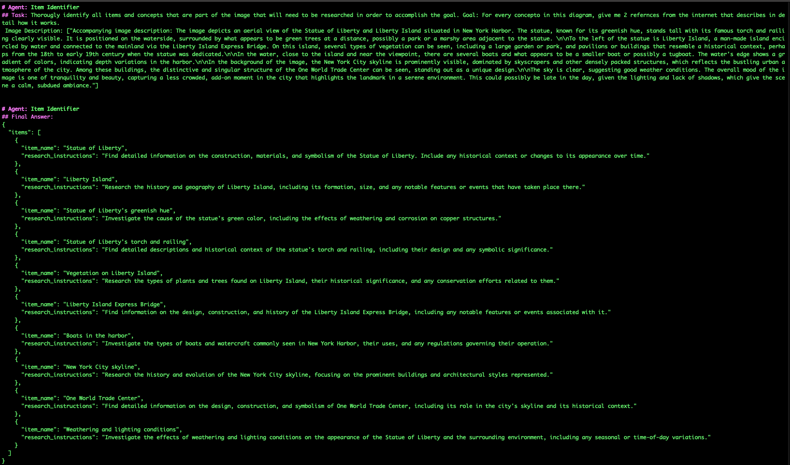
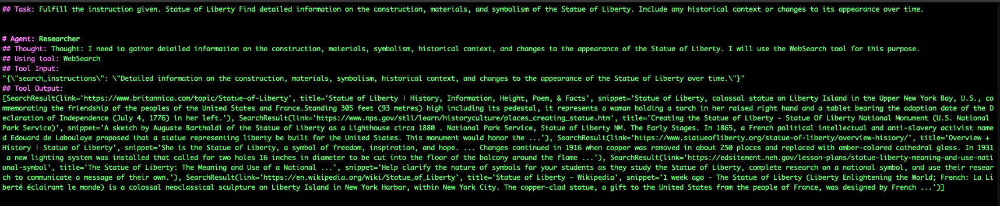

# Build an AI Research Agent for Image Analysis Using Granit 3.2 Reasoning and Vision Model

## Overview

In this tutorial, we'll guide you through building an AI research agent that is capable of conducting in-depth research based on image analysis. Using the [Granite 3.2 Vision Model](https://github.com/ibm-granite-community) alongside the [Granite 3.2 8B Language Model](https://github.com/ibm-granite-community), which offers enhanced reasoning capabilities, you'll learn how to create an advanced image researcher. The best part? You can run everything locally using [Ollama](https://ollama.ai), [Open WebUI](https://github.com/open-webui/open-webui), and [Granite](https://github.com/ibm-granite-community), ensuring a private, cost-effective solution.

We'll leverage [CrewAI](https://docs.crewai.com) as our agentic AI framework, demonstrating how to orchestrate parallel, asynchronous research tasks across various topics. This approach enables efficient exploration of complex visuals, transforming images into actionable insights. Additionally, [CrewAI](https://docs.crewai.com) is constructed upon [LangChain](https://python.langchain.com), an open-source project offering an array of useful tools for agents.

To power the research, we'll incorporate retrieval-augmented generation (RAG), enabling the agent to fetch relevant information from both web sources and user-provided documents. This ensures that the generated insights are not only accurate but also grounded in up-to-date and contextually relevant content in real-time.

## Building on Our Previous Work

In our previous tutorial, "Build a multi-agent RAG system with Granite locally," we demonstrated how to build an agent that constructs a sequential plan to accomplish a goal, dynamically adapting as the task progresses. In this tutorial, we'll explore alternative methods of agent collaboration by developing a research agent that:

1. First identifies a structured plan of researchable topics based on an image and user instructions
2. Then commissions multiple parallel research agents to investigate each topic
3. Leverages RAG to pull insights from the web and user documents
4. Finally synthesizes the findings into a comprehensive report

You can access the fully open-source implementation of this agent, along with setup instructions in the [IBM Granite Community GitHub repository](https://github.com/ibm-granite-community).

## The Sample Application: Turning Images into Knowledge

They say a picture is worth a thousand words, but what if AI could turn those words into actionable insights, filling gaps in your understanding and offering deeper context? That's exactly what this Image Research Agent does. Whether it's a complex technical diagram or a historical photograph, the agent can break down its components and educate you on every relevant detail.

### Use Cases

This Image Research Agent supports these use cases:

- **Architecture Diagrams**: Understand components, protocols, and system relationships
- **Business Dashboards**: Explain KPIs, metrics, and trends in BI tools
- **Artwork and Historical Photos**: Analyze artistic styles, historical context, and related works
- **Scientific Visualizations**: Interpret complex charts, lab results, or datasets

By combining vision models, agentic workflows, and RAG-based research, this solution empowers users to transform visual data into meaningful insights. The result? Informed decision-making, deeper learning, and enhanced understanding across industries.

## How the AI Agents Work Together

The following image shows the workflow in action:


*AI agents workflow*

## Environment Setup

To set up your local environment, follow the steps outlined in the [IBM Granite Multi-Agent RAG tutorial](https://github.com/ibm-granite-community) and the [Granite Retrieval Agent GitHub repository](https://github.com/ibm-granite-community).

This solution uses [OpenWebUI](https://github.com/open-webui/open-webui) as a user interface and [Ollama](https://ollama.ai) for local inferencing, ensuring privacy and efficiency. Both components are powered by open-source tools, making it easy to deploy and manage the entire workflow on your local machine.

## Implementation Steps

### Step 1: Set Up Connections to the Two LLMs

First, we need to set up connections to the two LLMs we will be using:

- **[Granite Vision LLM](https://github.com/ibm-granite-community)** for transforming images into descriptive text
- **[Granite 3.2 Instruct](https://github.com/ibm-granite-community)** for all other language-related tasks including planning and reasoning

In this case, we are using the `q8_0` quantization instead of the default `q4_K_M`. This gives this agent better tool calling reliability, while still being lightweight enough to run locally.

```python
llm = LLM(
    model="granite3.2:8b-instruct-q8_0",
    base_url="http://localhost:11434",
    api_key="ollama",
    temperature=0
)

vision_llm = LLM(
    model="granite3.2-vision:2b",
    base_url="http://localhost:11434",
    api_key="ollama",
    temperature=0
)
```

### Step 2: Define the Research Item Identifier Agent

This agent analyzes the image description and user query to identify key features and concepts requiring research.

**Inputs:**
- Image description generated by the Image Explainer
- User's research goal or context

**Outputs:**
- Structured list of items for further research

```python
# Using Pydantic for structured output
# See: https://docs.pydantic.dev
class ResearchItem(BaseModel):
    item_name: str
    research_instructions: str

class ResearchItems(BaseModel):
    items: List[ResearchItem]

item_identifier = Agent(
    role='Item Identifier',
    goal='Identify concepts in the image requiring research.',
    llm=llm
)

identification_task = Task(
    description='Identify all researchable items in the image description.',
    agent=item_identifier,
    expected_output='List of items and concepts for further research.',
    output_pydantic=ResearchItems
)

identifier_crew = Crew(
    agents=[item_identifier],
    tasks=[identification_task],
    process=Process.sequential,
    verbose=True
)
```

We are using a crew that consists of a single task and a single agent. The `output_pydantic=ResearchItems` portion instructs the LLM to output its structure into a Python object that can be directly leveraged in the next step of the plan. This uses [Pydantic](https://docs.pydantic.dev) for structured output validation.

### Step 3: Define the Research Crew

For each identified research item, a separate Research agent runs asynchronously, using RAG to search the web and user documents. The beauty of receiving the output of the previous agent as a Python list object is that we can now provide that list of research items to our Research Crew to kick off parallel, asynchronous research tasks for each item in the list.

**Inputs:**
- List of research items from the Research Item Identifier

**Outputs:**
- Detailed information, including references and explanations, for each item

```python
researcher = Agent(
    role='Researcher',
    goal='Conduct detailed research for each identified concept.',
    tools=[do_web_search, do_knowledge_search],
    llm=llm
)

research_task = Task(
    description='Fulfill the instruction given. {item_name} {research_instructions}',
    agent=researcher,
    expected_output='Information that directly answers the instruction given, with in-line citations for every reference.'
)

research_crew = Crew(
    agents=[researcher],
    tasks=[research_task],
    verbose=True
)
```

### Step 4: Pulling the Agents Together

1. Make a call to the [Granite Vision model](https://github.com/ibm-granite-community) to describe the image:

```python
image_query = "Describe the image in detail for educational purposes."
image_description = vision_llm.call([
    {"role": "user", "content": image_query, 'type': 'image_url', 'image_url': {'url': 'data:image/png;base64,.....'}}
])
```

2. Use the "Identifier Crew" to create a structured Python object representing all of the items contained in the image that need to be researched:

```python
identifier_crew.kickoff(image_description)
```

3. Then, use an asynchronous, parallel kickoff of the "Research Crew" to perform retrieval for each research query:

```python
tasks = []
for task in identification_task.output.pydantic.items:
    tasks.append({"item_name": task.item_name, "research_instructions": task.research_instructions})

output = research_crew.kickoff_for_each_async(tasks)
```

4. Finally, summarize the findings into a comprehensive report:

```python
final_output = llm.call(f"""Thoroughly answer the user's question, citing all references.
User query: {instruction}
Image description: {image_description}
Gathered information: {output}""")
```

## Example: Analyzing a Sample Image

In the following example, we use a sample image of the Statue of Liberty, a public domain image courtesy of the Library of Congress, specifically a photo taken by Carol M. Highsmith. I was hoping it would teach me some history about the statue and anything else depicted in the image.

The first step of the agent's process is describing the image, and then breaking that down into individual items to be researched. Below is the output of the agent, which, when deployed in OpenWebUI, can be seen in the Open WebUI server logs.



*Server logs depicting JSON output of proposed research items*

Once the tasks have been established, a swarm of Research Agents begin their tasks. Below is some of the task output.



After all the researchers have completed their task, you will see a detailed output report, complete with hyperlinks to all referenced sources.


*Output of chat in Open WebUI*

## Conclusion

The Image Researcher Agent demonstrates how generative AI can transform static images into rich, educational insights. By leveraging [CrewAI](https://docs.crewai.com), the [Granite Vision and Reasoning Models](https://github.com/ibm-granite-community), and parallel research workflows powered by RAG, users can explore complex visuals with clarity and context.

These machine learning models have come a long way since the days when generative AI relied on generative pre-trained transformers (GPTs). With the advent of agentic AI, models can now function as research tools capable of driving automation and deep research tasks. Agentic AI offers several solutions for enterprise use cases, such as analyzing merchandise pricing for marketing research, studying scientific research papers for discovery and understanding, and even optimizing hiring processes by gathering and reporting on resumes and LinkedIn profiles.

Try deploying your own Image Researcher Agent using the code provided and unlock the potential of image-driven learning!

